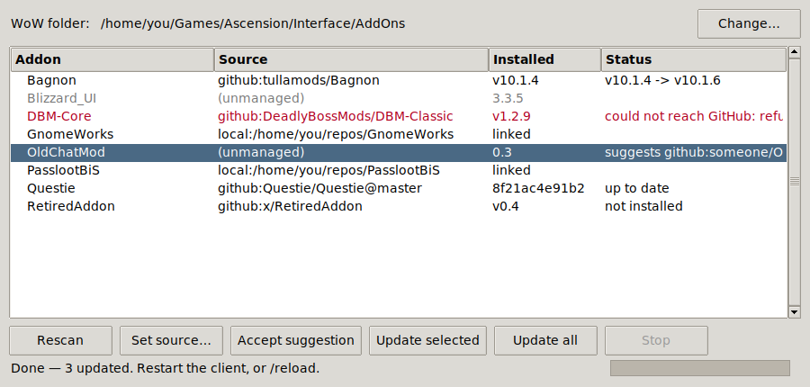

# WoW Addons from GitHub

Install and update World of Warcraft addons from whatever repositories **you** choose.

Point it at your WoW folder, let it scan what is already installed, bind each addon to
where its updates should come from, and update.

There are two ways to use it, over the same engine — a window, or the terminal.

### The window (Linux)

Download the AppImage from [Releases](../../releases), make it executable, and open it.

```
chmod +x WoW-Addons-from-GitHub-x86_64.AppImage
./WoW-Addons-from-GitHub-x86_64.AppImage
```

About 20 MB, and that is everything: its own Python, its own Tk, and the tool. No install,
nothing to keep updated, and deleting the file uninstalls it. It asks for your WoW folder
the first time, then shows every addon it found with the source bound to each one.

It runs on anything with glibc 2.17 or newer — CentOS 7 era, and older than anything
anyone is realistically running.

> **If it will not start** with an error mentioning `libfuse.so.2`, your distribution no
> longer ships FUSE 2 — recent Debian and Ubuntu do not. Either install it
> (`sudo apt install libfuse2`, or `libfuse2t64` on newer Debian and Ubuntu), or skip it
> entirely with `./WoW-Addons-from-GitHub-x86_64.AppImage --appimage-extract-and-run`.
> That is the whole problem; nothing else about the AppImage needs anything installed.

A Windows `.exe` is next — see [Windows](#windows).

### The terminal

```
python3 addons.py init ~/Games/Ascension
python3 addons.py scan
python3 addons.py set MyAddon github:someone/MyAddon
python3 addons.py update
```

The CLI stays first-class and is not going anywhere. The AppImage is the same tool: give
it arguments and it behaves exactly like the script above.

```
./WoW-Addons-from-GitHub-x86_64.AppImage update --check
```

## Why

The addon managers for private realms tend to have two problems: the catalogue is theirs, so
you cannot point an addon at an arbitrary repository, and some of them report what you
install whether or not you opted in.

This does neither. There is no catalogue, no account and **no telemetry of any kind** — it
contacts exactly the hosts named in your own manifest and nothing else. `update` reaches
`api.github.com` only for addons you have actually bound to a GitHub repository, and reaches
nothing at all for addons you keep on local disk.

It uses nothing but the Python standard library — no dependencies, in the tool or in the
window. That is why the AppImage is one self-contained file you delete when you are done
with it, and why the window is Tkinter rather than something prettier that would have put
a package manager between you and a working program.

## Requirements

**The AppImage needs nothing.** It carries its own Python and its own Tk. FUSE 2 at
runtime is the only caveat, and `--appimage-extract-and-run` sidesteps even that.

Running from a checkout instead needs **Python 3.9 or newer**, and that is the whole list.

- **Linux:** already present on essentially every distribution. For the window you may also
  need Tk, which some distributions package separately: `sudo apt install python3-tk`,
  `sudo dnf install python3-tkinter`, or `sudo pacman -S tk`. Running the tool with no
  arguments tells you which of these you want if it is missing.
- **Windows:** `winget install Python.Python.3.12`, or python.org — Tk is included. A
  packaged `.exe` that removes this step is planned — see [Windows](#windows) below.

## Commands

| Command | What it does |
|---|---|
| `init <path>` | Remember where the client is. Accepts your WoW folder, its `Interface` folder, or `Interface/AddOns` itself. |
| `scan` | Read every addon already installed and record it, guessing a source from each `.toc` where it can. |
| `list` | Every addon, its source, and its installed version. |
| `set <Addon> <source>` | Bind one addon to where its updates come from. |
| `accept` | Take every source that `scan` suggested, in one go. |
| `update [Addon...]` | Bring bound addons up to date. Defaults to all of them. |
| `where` | Print the manifest and AddOns paths. |

Useful flags on `update`: `--check` (report what is out of date, download nothing),
`--dry-run`, `--force` (reinstall even when the version matches).

## Sources

| Source | Behaviour |
|---|---|
| `local:<path>` | A folder on disk. Installed as a **symlink** by default, so `git pull` in that checkout *is* the update — nothing to reinstall, and the client cannot be running something other than what is checked out. `--copy` for real files instead. |
| `github:owner/repo` | Latest release, preferring an attached `.zip` and falling back to the source archive. |
| `github:owner/repo@branch` | That branch's current head, for an addon that does not cut releases. |
| `unmanaged` | Left alone. The default for anything `scan` finds and cannot place. |

`scan` reads each `.toc` for an `X-Website` or `X-Repository` header and *suggests* a GitHub
source where it finds one. Suggestions are never applied on their own — a header is the
author's claim about where the code lives, which is not the same as your decision to install
from there. `accept` applies them all once you have looked.

Archives are unpacked whatever shape they arrive in: a packaged release
(`MyAddon/MyAddon.toc`), GitHub's source archive (`repo-1a2b3c/MyAddon/MyAddon.toc`), and a
repository whose root *is* the addon (`repo-1a2b3c/MyAddon.toc`) all end up correctly as
`AddOns/MyAddon/MyAddon.toc`.

> Pointing a `github:` source at a repository containing **several** addon folders installs
> all of them. That is intended for multi-addon repositories, but it will surprise you if you
> expected one.

## The window



Everything the terminal does, in one window:

- **Set source…** opens a dialog over the selected addon: a local folder (with Browse),
  a GitHub repo, an optional branch to track, or unmanaged.
- **Accept suggestion** takes what an addon's `.toc` suggested — for the rows you pick,
  on a click you make. It is shown in the Status column and never applied on its own,
  for the same reason `accept` is a separate command in the terminal.
- **Update selected** / **Update all** run in the background, so the window stays
  responsive while things download. **Stop** ends the run after the addon in flight
  rather than mid-download, which leaves the manifest agreeing with the disk.
- A repository that cannot be reached marks **that row** red and leaves the rest to
  finish. There is no error dialog to dismiss per failure.
- Binding an addon that exists as real files says so in the dialog, and names the
  `<Name>.replaced` folder it would move them to, *before* you click Save.

## Things it will not do to your client

- **It never deletes an addon you already had.** Binding an addon that exists as real files
  moves the old folder to `<Name>.replaced` first. Nothing inside it matches that name, so
  the client ignores it; delete it yourself once you are satisfied.
- **One failed source does not sink the run.** An unreachable, private or renamed repository
  is reported and skipped — everything else still updates, and the manifest still saves.
- **Archives containing `../` paths are refused.** This unpacks zips published by third
  parties.
- **Your manifest stays out of the way**, at `$XDG_CONFIG_HOME/wow-addons/manifest.json` —
  in practice `~/.config/wow-addons/manifest.json`, and `%APPDATA%\wow-addons\` on Windows.
  It holds your disk paths, so it does not belong in a repository. `where` prints the
  resolved location.

`GITHUB_TOKEN` is honoured if set, and is entirely optional: unauthenticated GitHub allows 60
requests an hour, which is far more than a personal addon list needs.

Restart the client, or `/reload`, to pick changes up.

## Linux, Wine and Proton

Symlinks pass straight through to the Windows side, so the client sees an ordinary folder.
No configuration needed.

The one exception is **Flatpak Bottles**, whose sandbox cannot follow a link out to your home
directory. Grant it the checkout once:

```
flatpak override --user --filesystem=/path/to/your/checkout com.usebottles.bottles
```

Then restart Bottles. Or bind that addon with `--copy` and avoid links entirely.

## Windows

The tool runs on Windows with Python installed — the CLI, the window, and both source
types. The two things that used to be Linux-shaped are fixed:

- **`local:` sources install as a directory junction**, not a symlink. `os.symlink` on
  Windows needs administrator rights or Developer Mode; a junction needs neither, and the
  client cannot tell the difference. `--copy` still works if you would rather have real
  files.
- **The manifest lives in `%APPDATA%\wow-addons\`.** If you used an earlier version, your
  old manifest under `~/.config\wow-addons\` is read automatically and moves to the new
  location the next time anything is written — you do not need to do anything.

**A packaged `.exe` is the next piece of work.** The window and the engine behind it are
already done and platform-independent, so what remains is PyInstaller and a release job.

Worth knowing in advance: an unsigned `.exe` triggers SmartScreen's "Windows protected
your PC", which only a code-signing certificate removes. The AppImage has no equivalent
problem, which is why Linux was the honest first release.

The full design and packaging plan is in [UI-PLAN.md](UI-PLAN.md).

## Development

```
wowaddons/core.py   the engine: manifest, scanning, sources, install. Never prints.
wowaddons/cli.py    argparse, and the only module that writes to a terminal
wowaddons/gui.py    the Tkinter window
addons.py           launcher: the window with no arguments, the CLI with them
packaging/appimage/ the AppImage recipe and its build script
```

Both front ends call `core.update_addon` for one addon at a time, which is what keeps them
from drifting: the rule that one failure does not sink the run is written once, not once
per front end. Nothing in `core` prints — that is the constraint that makes a window
possible at all, and it is worth defending.

```
python3 -m unittest discover -s tests -t . -v          # 53 tests
xvfb-run -a python3 -m unittest discover -s tests -t . # including the window
```

No network and no game client: archives are built in memory, the GitHub API is stubbed,
and the window tests stub the engine and drive Tk headlessly. They run in about a second.
The window tests skip themselves where there is no display, so a checkout on a server
stays green; CI has a job that installs Tk and Xvfb on purpose and fails if they skip.

The suite is not there for coverage. It pins the things that actually broke, plus the
guards whose failure would otherwise be silent: an archive whose root is the addon
installing under GitHub's wrapper name (which the client ignores), a `403` reported as a
rate limit when the real cause was a blocked proxy or a private repository, and an
AppImage entry point that stops going through the wrapper that sets up Tcl/Tk — which
would produce a build that passes every check except opening a window.

### Building the AppImage

```
packaging/appimage/build.sh
packaging/appimage/smoke-test.sh dist/WoW-Addons-from-GitHub-x86_64.AppImage
```

`build.sh` puts its own tooling in `.build-venv/` and installs nothing into your Python.
The AppImage itself has no dependencies — `python-appimage` is used to wrap a manylinux
CPython that already contains Tkinter, and only the standard library and the `wowaddons`
package end up inside.

Its glibc floor comes from that bundled interpreter (manylinux2014, glibc 2.17), not from
the machine doing the building, because none of this project is compiled. The usual
AppImage advice to build on the oldest distribution you support does not apply.

The icon is drawn by `packaging/appimage/make_icon.py` using nothing but `zlib` and
`struct`, so it stays a readable diff rather than an opaque blob; a test re-runs it and
fails if the committed PNG has drifted.

## Licence

MIT — see [LICENSE](LICENSE).
